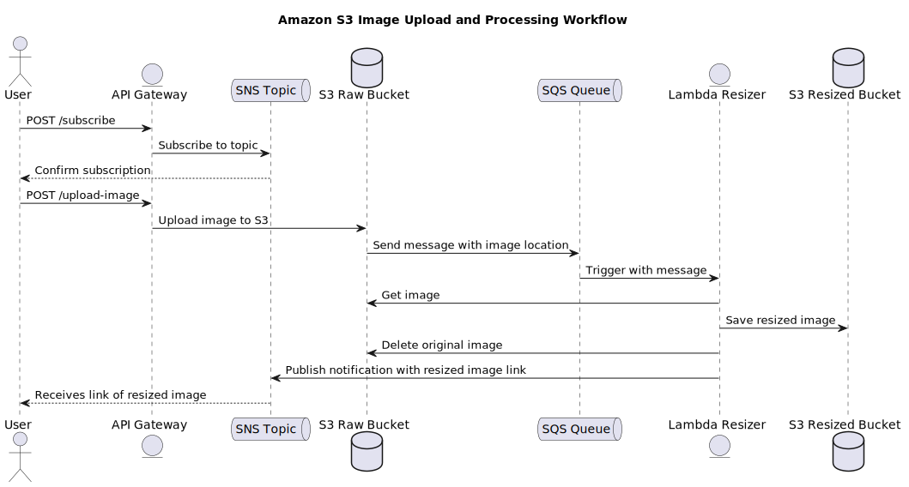

# Amazon S3 Image Upload and Processing Workflow

This project provides an AWS cloud infrastructure to upload images to S3, automatically resize them with AWS Lambda, and notify the user via SNS.

## How It Works

The following sequence diagram illustrates the workflow of the image upload and processing system:



1. The user subscribes to the SNS topic through a POST request to the API Gateway.
2. The user uploads an image to the S3 bucket using the API Gateway.
3. The S3 bucket triggers an event that sends a message to the SQS queue.
4. The Lambda function is triggered by the message in the SQS queue.
5. The Lambda function retrieves the original image, processes it, and uploads it to the resized image bucket.
6. After processing, the Lambda function publishes a message to the SNS topic with a link to the resized image.
7. The user receives a notification with the link to the processed image.

## Technologies
This project is built using a range of AWS services and other technologies. Below is a list of the core components: 
- AWS S3
- AWS Lambda
- Amazon API Gateway
- AWS Simple Notification Service (SNS)
- AWS Simple Queue Service (SQS)
- AWS IAM
- AWS Cloud Development Kit (CDK)
- Python

## Prerequisites
- AWS CLI
- AWS CDK
- Node.js and NPM (required for AWS CDK)
- Python 3.x
- Git

## Installation
1.  **Configure AWS CLI** Make sure you have configured AWS CLI with the correct access credentials and default region:
 ```
 aws configure
 ```
 2. **Clone the Repository**
Clone this repository to your local machine:
 ```
 git clone https://github.com/aws-image-processor.git
 cd aws-image-processor
 ```
3.**Install Dependencies**

Install the required npm and Python dependencies:
```
npm install python -m
pip install -r requirements.txt
```
4. **Bootstrap Your AWS Environment (if necessary)**

If this is your first time using AWS CDK in this region, you'll need to bootstrap your AWS environment:
```
cdk bootstrap
```

## Deployment
Deploy the stack to your AWS account:
```
cdk deploy
```


## Usage
### Subscribing for Image Processing Notifications

To subscribe to the SNS topic for receiving notifications after image processing, make a POST request to the API Gateway endpoint:

```
curl -X POST https://your-api-gateway-url/subscribe \
     -H "Content-Type: application/json" \
     -d '{"email": "your-email@example.com"}'
```
Replace `https://your-api-gateway-url/subscribe` with your API Gateway endpoint and `your-email@example.com` with your actual email address.


### Uploading Images for Processing

To upload an image for processing, make a PUT request to the API Gateway endpoint:
```
curl -X PUT https://your-api-gateway-url/upload-image/{bucket-name}/{filename} \ --data-binary @path-to-your-image.jpg
```
## Cleanup

To avoid incurring future charges, remove the deployed resources:
```
cdk destroy
```
